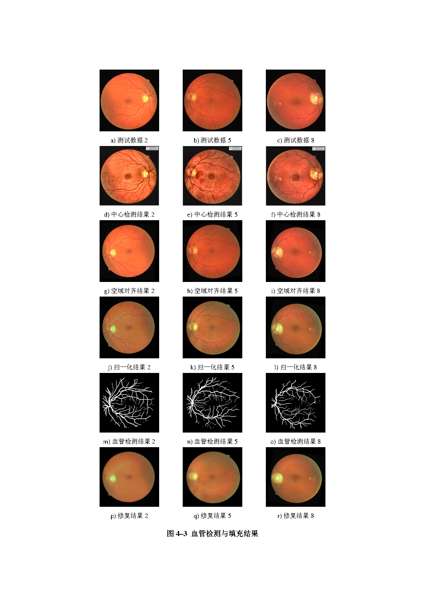

# Preprocessing of Color Fundus Retinal Images

Used FasterRCNN and RetinaNet networks for central point detection and color normalization, and used U-NET based architecture for blood vessel segmentation and filling based on OpenCV and Pytorch. Pre-processed the color fundus retinal images to achieve normalization of size, position and color, which could be used for completing future focus recognition tasks. Achieved the accuracy of central point detection and blood vessel detection up to 100% on the validation set.

## Requirements

opencv-python version 3.4.4.19

Pillow version  6.2.1

matplotlib version 3.0.2

numpy version 1.17

torch version 1.6

## Getting Started

### central point detection

```
python Retina/main.py
```

### color normalization and blood vessel segmentation and filling

```
python Vessel_seg/seg.py
```

## Results




